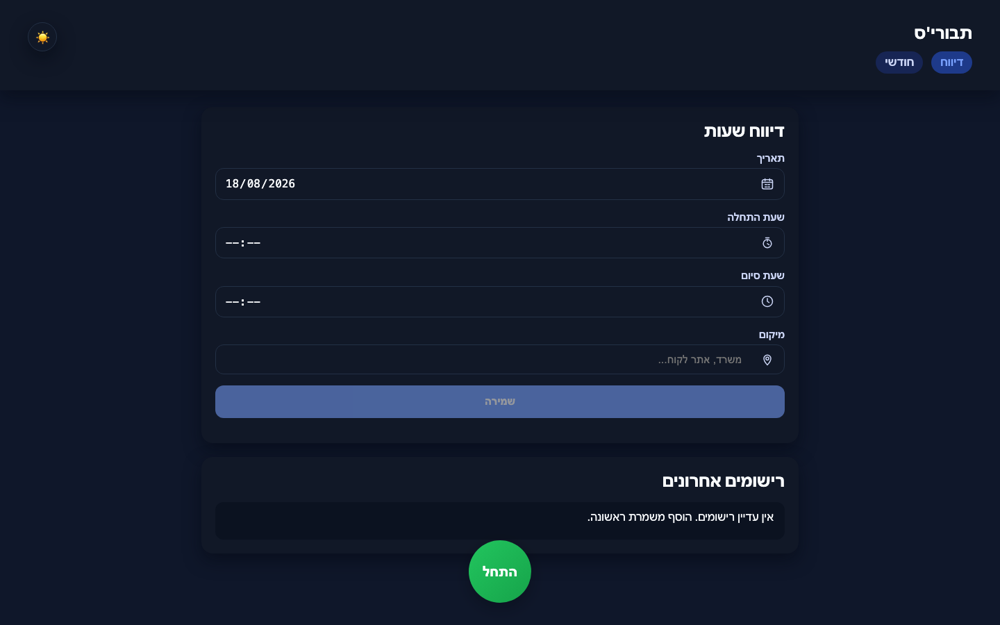
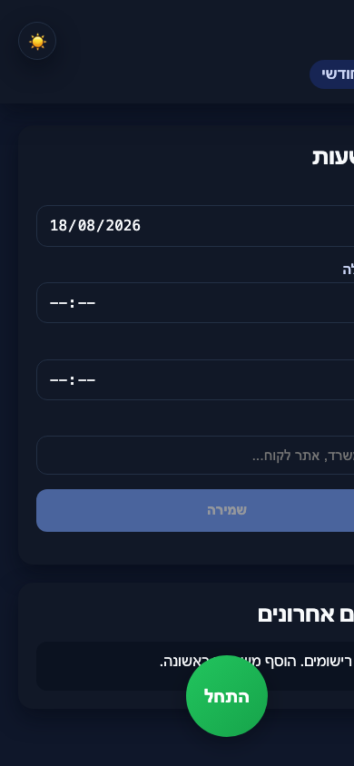

# Tavori's

A Hebrew right-to-left work-hours tracker for recording daily shifts, locations, and monthly summaries.

**Live site:** [onchetrit.github.io/tavoris](https://onchetrit.github.io/tavoris/)

## Highlights

- Enter a shift date, start and end times, and work location.
- Review recently saved entries.
- View a monthly summary in a dedicated page.
- Supports dark mode and right-to-left layout.

## Tech

Vanilla HTML, CSS, and JavaScript.

## Screenshots

| Desktop | Monthly view | Mobile |
| --- | --- | --- |
|  |  |  |

## Run locally

~~~bash
python3 -m http.server 8080
~~~

Open http://localhost:8080.
